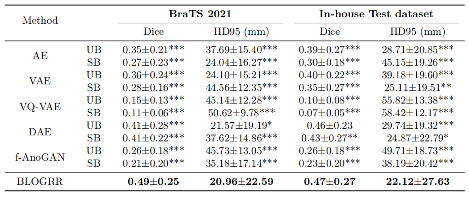

# Unsupervised Brain Tumor Segmentation via Bi-Level Optimization Guided by Radiological Reports
Official PyTorch implementation for our MICCAI 2025 workshop paper: "Unsupervised Brain Tumor Segmentation via Bi-Level Optimization Guided by Radiological Reports"

## Abstract
Unsupervised brain tumor segmentation can aid brain tumor diagnosis and treatment without the high cost of manual annotations. Existing methods typically use a reconstruction-based strategy, where an image self-reconstruction network is trained with normal data and applied to images with brain tumors. The reconstruction error map is then used to indicate the tumor regions and is thresholded to obtain tumor segmentation. However, optimal threshold selection is challenging without annotations in the unsupervised case, which limits the accuracy and applicability of these reconstruction-based methods. To address the problem, in this work we propose the Bi-Level Optimization Guided by Radiological Reports (BLOGRR) framework for unsupervised brain tumor segmentation. BLOGRR extends the reconstruction-based strategy with an additional threshold estimation network. Instead of selecting an empirical fixed threshold, it determines an adaptive threshold for every sample. Specifically, we develop an iterative bi-level optimization procedure, where lower and upper loops jointly update the reconstruction network and threshold estimation network. As no manual annotation is available, BLOGRR resorts to radiological reports, which provide key descriptions of image anomalies in the form of natural language, for learning the threshold determination. The reports are processed with brain anatomical knowledge to indicate potential tumor regions. Two loss functions are developed for the two loops to optimize the reconstruction network and threshold estimation network. Experimental results on a public dataset and an in-house dataset indicate that BLOGRR outperforms existing unsupervised methods with noticeable improvements.

## Experimental results

  

