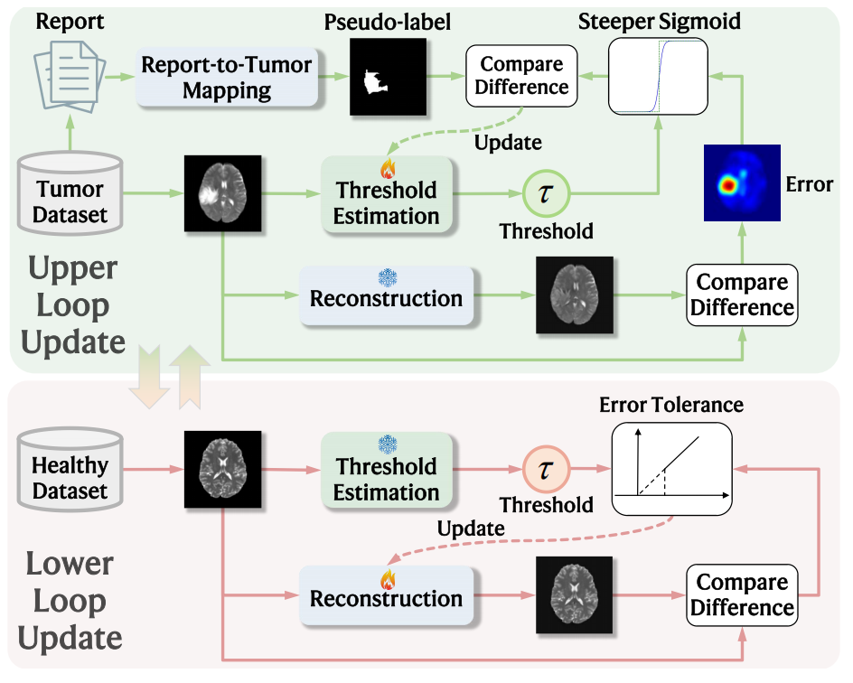

# Unsupervised Brain Tumor Segmentation via Bi-Level Optimization Guided by Radiological Reports
Official PyTorch implementation for our MICCAI 2025 workshop paper: "Unsupervised Brain Tumor Segmentation via Bi-Level Optimization Guided by Radiological Reports"

## Abstract
Unsupervised brain tumor segmentation can aid brain tumor diagnosis and treatment without the high cost of manual annotations. Existing methods typically use a reconstruction-based strategy, where an image self-reconstruction network is trained with normal data and applied to images with brain tumors. The reconstruction error map is then used to indicate the tumor regions and is thresholded to obtain tumor segmentation. However, optimal threshold selection is challenging without annotations in the unsupervised case, which limits the accuracy and applicability of these reconstruction-based methods. To address the problem, in this work we propose the Bi-Level Optimization Guided by Radiological Reports (BLOGRR) framework for unsupervised brain tumor segmentation. BLOGRR extends the reconstruction-based strategy with an additional threshold estimation network. Instead of selecting an empirical fixed threshold, it determines an adaptive threshold for every sample. Specifically, we develop an iterative bi-level optimization procedure, where lower and upper loops jointly update the reconstruction network and threshold estimation network. As no manual annotation is available, BLOGRR resorts to radiological reports, which provide key descriptions of image anomalies in the form of natural language, for learning the threshold determination. The reports are processed with brain anatomical knowledge to indicate potential tumor regions. Two loss functions are developed for the two loops to optimize the reconstruction network and threshold estimation network. Experimental results on a public dataset and an in-house dataset indicate that BLOGRR outperforms existing unsupervised methods with noticeable improvements.

## Network structure
<p align="center">  </p>

**Fig. 1.**  An overview of BLOGRR. BLOGRR consists of lower and upper loops, which jointly update the reconstruction network and threshold estimation network. Moreover, pseudo-labels are generated from radiological reports in the upper loops for updating the threshold estimation network. The lower and upper loops are performed iteratively.

## Experimental results
<p align="center">  </p>

**Table 1.** Means and standard deviations of the Dice coefficient and HD95 of the segmentation results. The UB and SB results of the competing methods are shown. Asterisks indicate that the difference between BLOGRR and the competing method is statistically significant (***: p < 0.001, **: p < 0.01, *: p < 0.05) with Wilcoxon signed-rank tests. The best results are highlighted in bold.

## Training
### Data Preparation
#### First Stage
We begin by registering all the datasets used in the study—including HCP, BraTS, and the in-house dataset—to the MNI152 standard space.

#### Second Stage
Since BLOGRR currently only supports 2D images, while most medical data comes in 3D volumes, the second step involves converting each 3D volume into 2D slices along the axial plane. Given that the initial and final slices of medical scans often contain little to no meaningful information, we recommend selecting slices between indices 30 and 120. As a result, each 3D volume will yield 120 2D slice images. These images are then resized to a resolution of 128×128 pixels.

#### Third Stage
Finally, the processed data is organized into specific directories. The folder structure for the datasets used in our experiments is as follows: **final_test_data** contains the BraTS2021 dataset used for final testing; **HCP_train_data** and **In_house_data** contain the training data for the BLOGRR model; **sample_test_data** is a small dataset used to monitor the BLOGRR training process in real time, which can be created by randomly sampling a subset of BraTS2021 data.
```
├── Dataset
│   ├── final_test_data
│   │   ├── img
│   │   └── seg
│   ├── HCP_train_data
│   │   └── img
│   ├── In_house_data
│   │   ├── img
│   │   └── seg
│   ├── sample_test_data
│   │   ├── img
│   │   └── seg
```

### Start Training
#### First Stage
After preparing your dataset, modify the dataset loading code in **dataload.py** according to your file naming convention. This part is quite straightforward, and you should be able to handle it easily!
Additionally, if you've stored your dataset in a custom directory structure rather than following the format described in the Data Preparation section, you'll need to update the dataset paths in the **get_config** function within **BLOGRR.py** accordingly.
#### Second Stage
Run the following command to start training. During the training process, you can monitor the results in real-time using wandb. You can either manually save the best-performing model or use the final epoch’s model. However, it's recommended to select the best model based on the wandb visualization to better reproduce the results presented in the paper.
```
python BLOGRR.py
```
#### Third Stage
After training is completed, you will find the trained reconstruction network in the **Save_model/lower directory**, and the trained threshold estimation network in the **Save_model/upper directory**.

### Start evaluting
You can switch between training and testing modes by directly modifying the **config.eval** parameter in **BLOGRR.py**. When **config.eval=True**, running **BLOGRR.py** performs testing; when **config.eval=False**, it performs training.
The figure below is the experimental results in the paper:
<p align="center">  </p>

